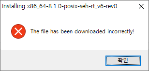
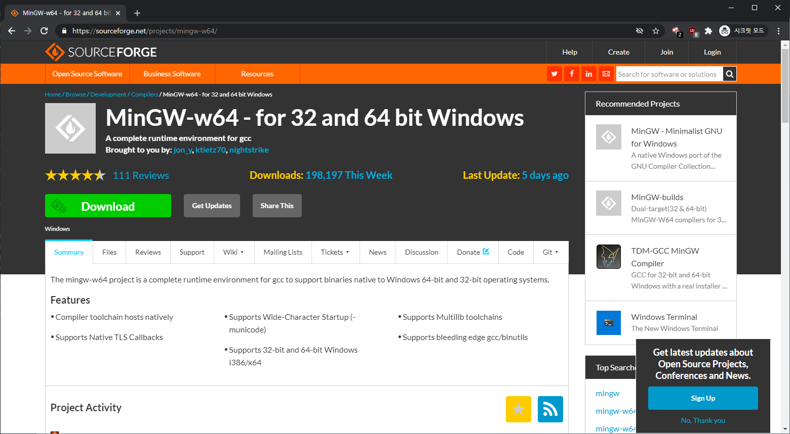
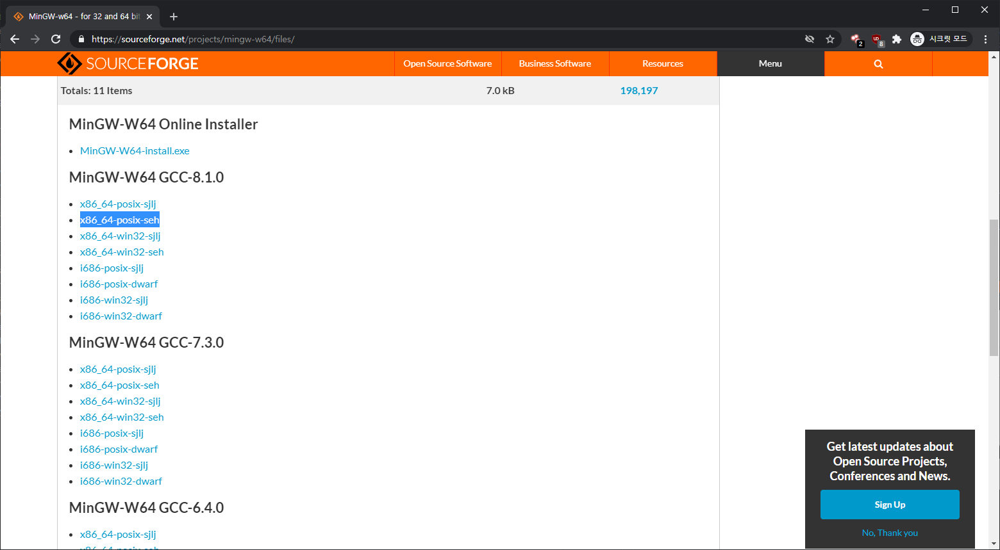
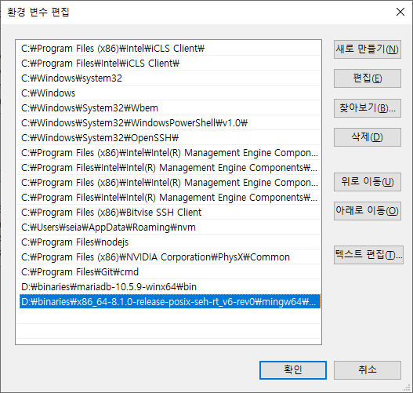
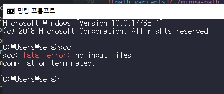

간단한 코드들의 빌드는 굳이 무거운 Visual Studio의 MSVC를 필요로 하지 않았기 때문에 Mingw64의 gcc로 모든 것을 해결하곤 했습니다.
하지만 얼마 전부터 Windows에서 제가 C99 코드들을 빌드할 때 사용하던 Mingw64의 온라인 인스톨러가 작동하지 않기 시작했습니다.

> 위와 같이 파일이 정상적으로 다운로드되지 않았다며 설치를 중단시킵니다.

그렇기 때문에 이제 Sourceforge에서 직접 바이너리 파일을 다운로드받아 사용해야 합니다.

> [Mingw64-w64 - for 32 and 64 bit Windows](https://sourceforge.net/projects/mingw-w64/)

먼저 위에 첨부된 Sourceforge 웹 사이트에서 Files 버튼을 클릭합니다.
그럼 이제 배포 중인 모든 형식을 볼 수가 있습니다.

저희는 여기에서는 x86_64-posix-seh 버전을 다운로드받아 사용할 예정입니다.

다운로드받은 압축파일을 해제하고 내부의 `mingw/bin` 폴더를 환경 변수에 추가합니다.
그럼 다음과 같이 정상적으로 gcc가 실행되는 모습을 볼 수 있습니다.

